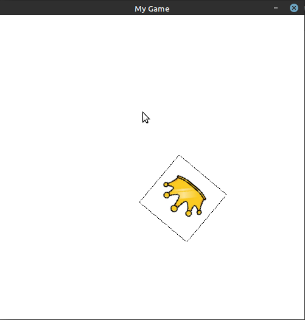
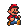
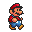

Sprites
=======

Sprites are a great part of Pygame Extra, let's use them!

Syntax
------

Here is the syntax, running this will return the sprite object:

.. code-block:: python

    sprite.make(imagef, size, position, rotation=0, layer=0)

Now let's go over everything:

* imagef - this is the image file(s), aka the sprite file
* size - the sprite size in pixels, aka the image size
* position - the center position of the sprite
* rotation - the rotation of the sprite, this is automatically set to 0, so you don't have to set it, unless you want the image to start off rotated
* layer - the layer the sprite is rendered on

Variables
---------

Great, now the variables of a sprite:

* image - the loaded image object(s)
* rotation - the rotation value
* position - the center position value or (x,y)
* rect - aka size
* size - the size multiplier of the sprite, this is one by default
* new - the updated image aka the current sprite with all its values loaded on
* refresh - this is a variable for the user to use, to keep track of whether a sprite should be updated, this variable is only in place to save time, it's set to True by default
* layer - the layer the sprite is on
* step - the amount the animation steps each game loop cycle
* ping_pong - the way the animation is player, if "True" the animation will go ``1,2,3,2,1``

Init
----

There's something very important to keep in mind, when you edit a sprite's variable, that really all your doing, is editing variables, to make pygame use these variables and make the new image we do:

.. code-block:: python

    spriteOBJ.init(spriteOBJ)
    
If you don't want to init the entire sprite that's fine, there's an init for everything separately!

.. code-block:: python

    spriteOBJ.init_rotation(spriteOBJ)

.. code-block:: python

    spriteOBJ.init_position(spriteOBJ)

All sprite inits return the "new" aka "spriteOBJ.new" variable, witch has been updated, from there you can display it with:

.. code-block:: python

    sprite.display(spriteOBJ)

Making and Displaying
---------------------

Let's put all that knowledge into making a sprite!

.. code-block:: python

    import pygameextra as pe
    pe.display.make((500, 500), 'My Game')
    pe.fill.full((255,255,255))
    crown = pe.sprite.make('example.jpeg',(100,100),(250,250), 70)
    crown.init(crown)
    while True:
      for pe.event.c in pe.event.get():
        pe.event.quitcheckauto()
      pe.sprite.display(crown)
      pe.display.update()
    pe.quit()
    quit()

Animation
---------

Let's look over everything we can do to animate sprites!

Frames
++++++

For animation we need to specify 2 or more images.
To do that we simply supply a "list" of image files.
Say we have 4 walking animation frames:

.. code-block::

    walk = pe.sprite.make(["walk_01.png", "walk_02.png", "walk_03.png", "walk_04.png"],(100,100),(250,250), 0)

By default the image to be frame will be the first frame, in this case, "walk_01.png", to set the frame manually we would do:

.. code-block::

    walk.frame = x  # replace x with the frame you wish to switch to.

That's great, now when you want to display it, the selected frame will be displayed.

Note: even though the frames are stored in a list starting with 0, the first frame is 1, and when displayed it will be subtracted to 0!

Stepping
++++++++

It would be easier if the sprite could automatically step trough each frame, and that is an option.
Simply setting the step variable, every time the sprite goes to display, if will step that amount of frames.

Say we have:

.. code-block::

    walk.step = 0.05

Depending on the frame-rate if you we're to display the sprite every game loop, it should animate!

Sadly i can't show you animation, but here is an example code and images for you to try!

.. image:: _static/mario_02.png

.. code-block::

    import pygameextra as pe
    pe.display.make((500,500), "Mario")
    mario = pe.sprite.make(["mario_01.png", "mario_02.png", "mario_03.png", "mario_03.png", "mario_04.png"],(500,500),(0,0), 0)
    mario.step = 0.1
    while True:
        for pe.event.c in pe.event.get():
            pe.event.quitcheckauto()
        pe.fill.full(pe.color.white)
        pe.sprite.display(mario)
        pe.display.update()
        pe.time.tick(60)